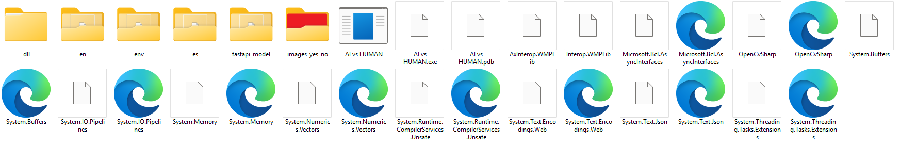
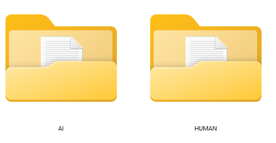

# AI detector

### English version

AI Detector is a desktop application created by an artificial intelligence student. It allows users to check whether any image, text, or video file was generated by generative AI. Furthermore, this application enables them to conduct research based on recognizing AI-generated content.

This application can be used to aid in distinguishing deepfake content and to help learn how to distinguish between them.

Currently, the application allows users to:
- distinguish whether a video or image file was generated by AI,
- conduct research with extensive customization options for the collected data (currently only for image files).

The models are created in Python using libraries such as:
- Torchvision,
- PyTorch,
- TensorFlow (a model responsible for text recognition during development).

The application was developed in Visual Studio using C#.

The application uses the FastAPI framework for better communication between the application and the AI ​​models.

The models were trained independently on both self-prepared data and publicly available datasets, such as:
- "AI vs. Real Images" © Sonal Raj — License Unspecified
- "Real vs. Fake Turkey Earthquake" © Merve Akdogan — License Unspecified
- "Shutterstock Dataset for AI vs. Human Gen Image" © Sachin Singh — License: Open Database / Content
- "AI Generated Images" © Muhammad Anas Mahmood — CC0: Public Domain
- "Dog and Cat Detection" © Larxel — CC BY-SA 4.0
- "AI vs. Human Generated Dataset" © Alessandra Sala, Manuela Jeyaraj, Toma Ijatomi, Margarita Pitsiani — Apache 2.0
- "AI Cat and Dog Images DALL·E Mini" © Matt OP — CC0: Public Domain
- "AI Generated Dogs JPG vs Real Dogs JPG" © Albert5913 - CC0: Public Domain
- "AI Generated Animal Images with 3 Generator" © LSHgrandvoyage - CC BY-SA 4.0
- "AI vs Human Text" © Shane Gerami — License Unspecified
- "AI vs Human Text Classification Dataset 2026" © Alita Qishah — CC0: Public Domain
- "AI and Human Text Dataset" © Hasany Iitakbulut — CC BY 4.0


### How to install

After download open terminal in APP\AI vs HUMAN and create envirement like that:

```bash
pip install -r requirements.txt
```

then activate envirement

```bash
env\Scripts\Activate.ps1
```

and install requirements

```bash
pip install -r requirements.txt
```

after that your project structire should look like this




### How to use

###### main
After launching, the first screen that appears is the startup screen used to launch the AI ​​models and to select the language by clicking the "Zmień język" button (polish is first language).

###### file_test

The first screen we see after launching the AI ​​models allows us to select a single file to check whether it was generated by AI, as well as to check the entire folder we selected. To perform the check, click the "CHECK!!!" button. If the selected single file is a video file, we will need to select the frame rate to be checked in a separate window. In this window, we can access the research module by clicking the "Research Module" button.

###### research_tool

This window is used to test people's ability to distinguish between human-generated and AI-generated content by clicking the "NO" and "YES" buttons. The study is highly customizable, allowing you to change settings by clicking the "Settings" button. The "Reset" button resets the study (requiring the selection of a new study folder, which will be described later). The "Stop Study" button interrupts the study. The "Back" button returns you to the file_test screen. The "Start" button allows you to select the study folder, i.e., the folder from which the files for the study will be taken. This folder must contain two folders: the first, "AI," containing all files generated by the AI, and the second, "HUMAN," containing files not generated by the AI. The "AI" and "HUMAN" folders cannot contain any other folders, and they can be the only folders in the study folder. At the end of the study, the researcher will be able to complete and save the data collected.



###### research_setting

A window for personalizing the researcher's experience, with a wide range of customization options, from selecting the question asked to the researcher, to choosing when the research should end, to whether and in what form feedback will be displayed to the researcher. Of course, you can also enable parallel file checking by the built-in AI, allowing for comparisons between human and AI models.


### Wersja Polska
AI Detector to aplikacja desktopowa stworzona przez studenta sztucznej inteligencji mająca na celu umożliwienie sprawdzania czy dowolny plik graficzny, tekstowy lub wideo zostały wygenerowane przez generatywną sztuczną inteligencję. Ponadto aplikacja ta umożliwia przerpowadzanie badań opartych na rozpoznawaniu generowanych przez AI treści. 

Aplikacja ta może służyć jako pomoc przy odróżnianiu treści typu deep fake jak i pomóc w nauce rozróżnianiu ich.

Na chwilę obecną aplikacja pozwala na:
 - rozróżnianie czy plik wideo lub graficzny został wygenerowany przez AI,
- prowadzenie badań z dużą możliwością personalizacji zbieranych danych (na chwilę obecna tylko dla plików graficznych).

Modele są stworzone w środowisku Python za pomocą takich bibliotek jak:
- Torchvision,
- PyTorch,
- TensorFlow (model odpowiedzialny za rozpoznawanie tekstów - podczas tworzenia).

Aplikacja została stworzona w Visual Studio za pomocą C#.
Aplikacja korzysta z struktury FastAPI dla lepszej komunikacji między aplikacją a modelami AI.

Modele zostały wytrenowane samodzielnie na własnoręcznie przygotowanych danych jak i za pomocą ogólnie dostępnych dataset-ów, takich jak:
- "AI vs Real Images" © Sonal Raj — Licencja nieokreślona
- "Real vs Fake Turkey Earthquake" © Merve Akdogan — Licencja nieokreślona
- "Shutterstock Dataset for AI vs Human Gen Image" © Sachin Singh — Licencja: Open Database / Content
- "AI Generated Images" © Muhammad Anas Mahmood — CC0: Public Domain
- "Dog and Cat Detection" © Larxel — CC BY-SA 4.0
- "AI vs Human Generated Dataset" © Alessandra Sala, Manuela Jeyaraj, Toma Ijatomi, Margarita Pitsiani — Apache 2.0
- "AI Cat and Dog Images DALL·E Mini" © Matt OP — CC0: Public Domain
- "AI Generated Dogs JPG vs Real Dogs JPG" © Albert5913 — CC0: Public Domain
- "AI Generated Animal Images with 3 Generator" © LSHgrandvoyage — CC BY-SA 4.0
- "AI vs Human Text" © Shane Gerami — Licencja nieokreślona
- "AI vs Human Text Classification Dataset 2026" © Alita Qishah — CC0: Public Domain
- "AI and Human Text Dataset" © Hasany Iitakbulut — CC BY 4.0

### Jak zainstalować

Po pobraniu otwórz terminal w APP\AI vs HUMAN i utwórz środowisko w następujący sposób:

```bash
pip install -r requirements.txt
```

Następnie aktywuj środowisko

```bash
env\Scripts\Activate.ps1
```

i zainstaluj wymagania

```bash
pip install -r requirements.txt
```

Po tym struktura projektu powinna wyglądać następująco:


### Jak korzystać

###### main
Po uruchomieniu pierwszy ekran jaki się ukaże to ekran startowy służący do uruchomienia modeli AI jak i do umożliwienia wyberania języka po przez kliknięcie w przycisk "Zmień język".

###### file_test

Pierwszy ekran jaki widzimy po uruchomieniu modeli AI, pozwala on na wybranie jednego pliku do sprawdzenia czy nie został on wygenerowany przez AI, jak i na sprawdzenie całego wybranego przez użytkownika folderu. Aby dokonać sprawdzenia należy kliknąć w przycisk "SPRAWDŹ!!!", jesli wybrany pojedyńczy plik jest plikiem wideo to wymagane będzie wybranie co która klatka będzie sprawdzana w osobnym oknie. W tym oknie mozliwe jest przejście do modułu badawczego po przez kliknięcie przycisku "Moduł badawczy".

###### research_tool

Okno służące do badania sprawności ludzi do odróżniania treści generowanych przez człowieko od tych generowanych przez AI, po przez klikanie w przyciski "NIE" oraz "TAK". Badanie jest wysoko personalizowalne przez mozliwość zmiany ustawień po przez kliknięcie w przycisk "Ustawienia". Przycisk "Reset" resetuje badanie (wraz z wymogiem wybranai nowego folderu badawczego, czym jest ten folder opisane będzie później). Przycisk "Przerwij badanie" przerywa badanie. Przycisk "Wróć" cofa do ekranu file_test. Przycisk zacznij pozwala na wybranie folderu badawczego, czyli folderu z którego będą brane pliki do przeprowadzania badania. Folder ten musi w sobie zawierać dwa foldery, pierwszy "AI" w którym będą znajdować się wszystkie pliki wygenerowane przez AI, drugi "HUMAN" w którym znajdować się mają pliki nie wygenerowane przez AI. Wewnątrz folderów "AI" oraz "HUMAN" nie może znajdować się więcej folderów, a one same mogą być jedynymi folderami folderu badawczego. Na końcu badania możliwe będzie uzupełnienie i zapisanie zbieranych przez badającego danych.


###### research_setting

Okno służące do personalizacji przeprowadzanego badania przez badającego z szerokim zakresem personalizacji, od wybrania pytania zadawanego badającemu przez wybór kiedy ma się zakończyć badanie, kończąć na tym czy badanemu będzie wyświetlana infrmacja zwrotna i w jakiej formie. Oczywiście można też uruchomić opcję rónoległego sprawdzania plików przez wbudowane AI co pozwala na porównywanie człowieka z modelami AI.


# Plans

### English version
An application created by an artificial intelligence student, which aims to provide a widely available tool for checking whether a selected file was generated by artificial intelligence or created by a human.

This tool is free and available to anyone who wants to check the authenticity of their file. The application uses two independently created AI models, the first for checking graphics, the second for checking texts (currently during training).

The tool is free because I want to show that artificial intelligence can be used to fight against generated content used to mislead people.

Below is a list of features that are already available in the application as well as those being added.

- [ ] Version 1.0
	- [x] Basic file checking functions
		- [x] Added the ability to check graphics
		- [x] Added the ability to check videos
		- [x] Added the ability to check texts
		- [x] Checking folders with graphics, videos and texts and returning results in a txt file
	- [x] Adding languages and the ability to easily switch between them
		- [x] Polish
		- [x] English
		- [x] Spanish
	- [x] Adding a research module
		- [x] Personalization of the study (adding time limit, number of files, type of files, scoring, etc.)
		- [x] Connecting your own files in the research module in a clearly defined format
			- [x] Using graphic files
			- [x] Using video files
			- [x] Using text files
		- [x] Not returning or returning results on an ongoing basis during the study at the user's request
		- [x] Not returning or returning results in the form of a txt file after the study is completed
		- [x] Saving results to a database
			- [x] The possibility of selecting data to save in the database
			- [x] The possibility of creating your own data to save in the database (maximum 5 data)
			- [x] The possibility of connecting an existing database in order to extend it with new data
	- [x] Creating a simple installer for Windows and Linux systems (.zip in releases on GitHub)
		- [x] Creating a simple installer for Windows system
- [ ] Version after Version 1.0
	- [ ] Adding the ability to check audio files
	- [ ] Adding the ability to check PDF files
	- [ ] Adding more languages (for example German, French, Italian, Chinese, Japanese)
	- [ ] Other possible changes and additions that may arise during the development of the project


### Wersja Polska
Aplikacja tworzona przez studenta sztucznej inteligenji, która ma na celu zapewnić ogólno dostępne narzędzie do sprawdzania czy wybrany plik został wygenerowany przez sztuczną inteligencję, czy też został stworzony przez człowieka. 

Narzędzie to jest darmowe i dostępne dla każdego, kto chce sprawdzić autentyczność swojego pliku. Aplikacja wykorzystuje saomdzielnie stworzone dwa modele SI, pierwszy do sprawdzania grafik, drugi do sprawdzania tekstów (obecnie podczas szkolenia).

Narzędzie jest darmowe, ponieważ chcę pokazać, że sztuczna inteligencja może być używana do walki z generowanymi treściami wykorzystywanymi do wprowadzania ludzi w błąd.

Poniżej znajduje się lista funkcji, które są już dostępne w aplikacji jak i będących w fazie dodawania.

- [ ] Wersja 1.0
	- [x] Podstawowe funkcje sprawdzania plików
		- [x] Dodanie możliwości sprawdzania grafik
		- [x] Dodanie możliwości sprawdzania wideo
		- [x] Dodanie możliwości sprawdzania tekstów
		- [x] Sprawdzanie folderów z grafikami, wideo i tekstami oraz zwracaniem wyników w pliku txt
	- [x] Dodanie języków i możliwości łatwego przełączania się między nimi
		- [x] Polski
		- [x] Angielski
		- [x] Hiszpański
	- [x] Dodanie modułu badawczego
		- [x] Personalizacja badania(dodanie limitu czasu, ilości plików, rodzaju plików, punktacji itp.)
		- [x] Podpięcie własnych plików w module badawczym w jasno określonym formacie
			- [x] Wykorzystywanie plików graficznych
			- [x] Wykorzystywanie plików wideo
			- [x] Wykorzystywanie plików tekstowych
		- [x] Nie zwracanie lub zwracanie wyników na bierząco podczas badania na rządanie użytkownika
		- [x] Nie zwracanie lub zwracanie wyników w formie pliku txt po zakończeniu badania
		- [x] Zapisywanie wyników do bazy danych
			- [x] Mozliwość wybrania danych do zapisu w bazie danych
			- [x] Możliwość stworzenia własnych danych do zapisu w bazie danych (maksymalnie 5 danych)
			- [x] Możliwość podpięcia istniejącej już bazy danych w celu jej rozszerzenia o nowe dane
	- [x] Storzenie prostego instalatora dla systemu Windows i Linux (.zip w releases na GitHub)
		- [x] Stworzenie prostego instalatora dla systemu Windows
- [ ] Wersja po Wersji 1.0
	- [ ] Dodanie możliwości sprawdzania plików audio
	- [ ] Dodanie możliwości sprawdzania plików PDF
	- [ ] Dodanie większej ilosci języków (przykładowo niemiecki, francuski, włoski, chiński, japoński)
	- [ ] Inne możliwe zmiany i dodatki, które mogą pojawić się podczas rozwoju projektu
